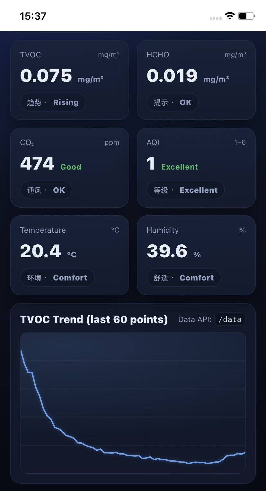

# ESP32 Air Monitor

A real-time air quality monitoring dashboard based on **ESP32 + SC-4M01A air sensor**.  
The ESP32 creates a WiFi hotspot and hosts a web dashboard that displays live environmental data.

## Features

- ESP32 hosts its own **WiFi Access Point**
- Real-time **air quality monitoring**
- Web dashboard accessible from **any phone or computer**
- Displays:
  - TVOC
  - HCHO (Formaldehyde)
  - CO₂
  - AQI
  - Temperature
  - Humidity
- Live updating chart for **TVOC trend**
- Modern **mobile-friendly UI**
## Demo

A quick demonstration of the ESP32 Air Monitor running in real time.

Click the image below to watch the demo video.

## Hardware

Required components:

- ESP32-S3 development board
- SC-4M01A air quality sensor
- USB cable
- 5V power supply

### Sensor Connection

| Sensor Pin | ESP32 Pin |
|------------|-----------|
| TX         | GPIO16    |
| RX         | GPIO17    |
| VCC        | 5V        |
| GND        | GND       |

UART configuration:
Baud rate: 9600
RX: GPIO16
TX: GPIO17

## How It Works

1. ESP32 reads sensor data via UART.
2. Data frames starting with header `2C E4` are parsed.
3. Sensor values are stored and exposed through a `/data` HTTP API.
4. A built-in web dashboard polls the API every second.
5. Data is visualized in real-time.

## WiFi Access

After flashing the firmware:
SSID: ESP32-AirMon
Password: 12345678

Open in your browser:

http://192.168.4.1

## Example Data Output

TVOC: 0.123 mg/m³
HCHO: 0.045 mg/m³
CO2: 850 ppm
AQI: 2
Temperature: 24.6 °C
Humidity: 42 %

## AQI Level (Sensor Internal Scale)

| AQI | Air Quality |
|----|-------------|
| 1 | Excellent |
| 2 | Good |
| 3 | Moderate |
| 4 | Poor |
| 5 | Bad |
| 6 | Severe |

Note: This is the **sensor's internal AQI scale**, not the official national AQI index.

## Project Structure

ESP32-Air-Monitor
│
├── ESP32_AirMonitor.ino
├── README.md
└── images

## Installation

1. Install **Arduino IDE**
2. Install **ESP32 Board Package**
3. Open the `.ino` file
4. Select your ESP32 board
5. Upload firmware

## Future Improvements

- WebSocket real-time streaming
- Historical data storage
- SD card logging
- MQTT integration
- Cloud dashboard
- Mobile app

## Author

Helin Sun
